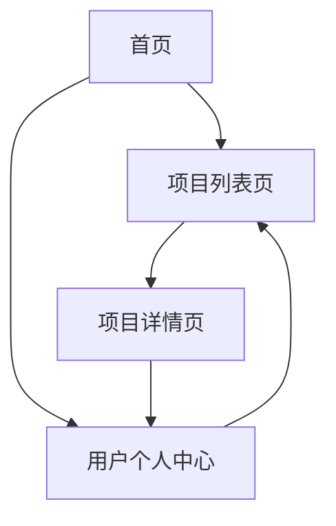

## 1. Product Overview
Python数据分析训练网站是一个专注于提供Python数据分析项目实战训练的在线平台，帮助用户通过实践掌握数据分析技能。
- 主要目标用户为数据分析师、数据科学爱好者和希望提升数据分析能力的学生。
- 平台提供10个结构化的数据分析项目，涵盖数据清洗、用户行为分析、销售预测等核心技能。

## 2. Core Features

### 2.1 User Roles
| 角色 | 注册方式 | 核心权限 |
|------|---------------------|------------------|
| 普通用户 | 邮箱注册 | 浏览项目、查看详情、个人中心 |
| 管理员 | 后台创建 | 管理项目、用户管理、内容发布 |

### 2.2 Feature Module
1. **首页**：英雄区、导航栏、项目分类、热门项目、学习路径
2. **项目列表页**：项目卡片展示、筛选功能、排序功能
3. **项目详情页**：项目描述、学习目标、核心任务、技术要点、任务步骤
4. **用户个人中心**：个人信息、学习进度、收藏项目、学习历史

### 2.3 Page Details
| 页面名称 | 模块名称 | 功能描述 |
|-----------|-------------|---------------------|
| 首页 | 英雄区 | 展示网站主题，包含吸引人的标题和CTA按钮 |
| 首页 | 导航栏 | 包含logo、主导航链接（首页、项目、关于我们、登录/注册） |
| 首页 | 项目分类 | 按难度和主题分类展示项目 |
| 首页 | 热门项目 | 展示最受欢迎的项目 |
| 首页 | 学习路径 | 提供从入门到进阶的学习路径 |
| 项目列表页 | 项目卡片 | 展示项目标题、难度、完成时间、简介 |
| 项目列表页 | 筛选功能 | 按难度、主题、技能标签筛选项目 |
| 项目列表页 | 排序功能 | 按热度、发布时间、难度排序 |
| 项目详情页 | 项目描述 | 详细介绍项目背景和目标 |
| 项目详情页 | 学习目标 | 列出学习该项目后可掌握的技能 |
| 项目详情页 | 核心任务 | 详细描述项目的核心任务和步骤 |
| 项目详情页 | 技术要点 | 列出项目涉及的技术和工具 |
| 项目详情页 | 任务步骤 | 提供详细的任务执行步骤 |
| 用户个人中心 | 个人信息 | 展示和编辑用户基本信息 |
| 用户个人中心 | 学习进度 | 展示已完成和进行中的项目 |
| 用户个人中心 | 收藏项目 | 展示用户收藏的项目 |
| 用户个人中心 | 学习历史 | 记录用户的学习活动和完成情况 |

## 3. Core Process
用户访问网站首页，浏览项目分类和热门项目，选择感兴趣的项目进入详情页了解具体内容，然后开始学习。用户可以注册账号，在个人中心查看学习进度和管理收藏项目。

## 4. User Interface Design
### 4.1 Design Style
- 主色调：蓝色系 (#165DFF) 和白色 (#FFFFFF)，辅助色：浅灰 (#F5F7FA)、深灰 (#4E5969)
- 按钮风格：圆角矩形，主按钮使用主色调，悬停时有轻微阴影效果
- 字体：无衬线字体，标题使用较大字号和粗体，正文使用适中字号
- 布局风格：卡片式布局，清晰的信息层次，充足的留白
- 图标风格：简洁现代的线性图标，配合主题色

### 4.2 Page Design Overview
| 页面名称 | 模块名称 | UI元素 |
|-----------|-------------|-------------|
| 首页 | 英雄区 | 渐变背景，大标题，简短描述，CTA按钮，动画效果 |
| 首页 | 导航栏 | 固定顶部，响应式设计，滚动时背景变化 |
| 首页 | 项目分类 | 卡片式布局，图标+文字，悬停效果 |
| 首页 | 热门项目 | 网格布局，项目卡片包含标题、难度、进度条 |
| 项目列表页 | 项目卡片 | 图片+文字组合，包含项目标题、简介、难度标签 |
| 项目列表页 | 筛选功能 | 侧边栏或顶部筛选器，下拉菜单和复选框 |
| 项目详情页 | 内容区域 | 清晰的章节划分，代码块样式，图表展示 |
| 用户个人中心 | 仪表板 | 卡片式布局，数据可视化，进度条 |

### 4.3 Responsiveness
- 采用移动优先的响应式设计
- 断点设置：移动端 (<768px)、平板 (768px-1024px)、桌面 (>1024px)
- 在小屏幕设备上优化布局，确保内容可读性
- 触摸友好的界面元素，适合移动设备操作

### 4.4 3D Scene Guidance
- 不适用，本项目为2D网页应用