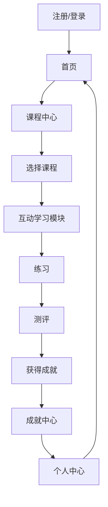

## 1. Product Overview
基于Python的数据分析在线教育平台，为商务数据分析与应用专业的学生提供完整的学习体系和互动式学习体验。
- 解决学生在数据分析学习过程中的实践和应用问题，提供系统化的课程内容和互动式学习模块
- 目标是成为商务数据分析专业学生的首选在线学习平台，提升其数据分析能力和就业竞争力

## 2. Core Features

### 2.1 User Roles
| 角色 | 注册方式 | 核心权限 |
|------|----------|----------|
| 学生 | 邮箱注册 | 浏览课程、参与互动学习、完成练习和测评、查看成就 |
| 管理员 | 后台创建 | 管理课程内容、用户数据、成就系统设置 |

### 2.2 Feature Module
1. **首页**：平台介绍、课程体系概览、最新活动、用户成就展示
2. **课程中心**：完整课程体系展示、课程详情、学习进度跟踪
3. **学习模块**：互动式学习内容、练习、测评
4. **成就中心**：个人成就展示、排行榜、激励系统
5. **个人中心**：用户信息管理、学习历史、成就记录

### 2.3 Page Details
| 页面名称 | 模块名称 | 功能描述 |
|---------|---------|----------|
| 首页 | 平台介绍 | 展示平台核心价值、目标用户和主要功能 |
| 首页 | 课程体系概览 | 展示完整课程体系结构，便于用户了解学习路径 |
| 首页 | 最新活动 | 展示平台最新活动和学习资源 |
| 首页 | 用户成就展示 | 展示用户的学习成就和进度 |
| 课程中心 | 课程列表 | 按类别和难度展示所有课程 |
| 课程中心 | 课程详情 | 展示课程内容、学习目标、讲师信息 |
| 课程中心 | 学习进度 | 跟踪用户在各课程中的学习进度 |
| 学习模块 | 互动学习 | 提供视频、文档、代码示例等多种学习形式 |
| 学习模块 | 练习系统 | 提供编程练习、数据分析案例等实践任务 |
| 学习模块 | 测评系统 | 提供阶段性测试，评估学习效果 |
| 成就中心 | 个人成就 | 展示用户获得的徽章、证书等成就 |
| 成就中心 | 排行榜 | 展示用户在平台中的排名情况 |
| 成就中心 | 激励系统 | 提供学习目标设定和奖励机制 |
| 个人中心 | 用户信息 | 管理个人基本信息和账号设置 |
| 个人中心 | 学习历史 | 查看历史学习记录和完成情况 |
| 个人中心 | 成就记录 | 详细记录所有获得的成就和奖励 |

## 3. Core Process
用户注册登录后，可以浏览课程体系，选择感兴趣的课程进行学习。在学习过程中，用户可以参与互动式学习模块，完成练习和测评。通过学习和完成任务，用户可以获得成就和奖励，提升在平台中的排名。

```mermaid
flowchart TD
    A[注册/登录] --> B[首页]
    B --> C[课程中心]
    C --> D[选择课程]
    D --> E[互动学习模块]
    E --> F[练习]
    F --> G[测评]
    G --> H[获得成就]
    H --> I[成就中心]
    I --> J[个人中心]
    J --> B
```

## 4. User Interface Design
### 4.1 Design Style
- 主色调：蓝色系 (#1E40AF) 和绿色系 (#10B981)，代表专业和成长
- 按钮风格：圆角设计，有轻微的3D效果，悬停时有平滑过渡动画
- 字体：使用 Inter 字体，主标题 24-32px，副标题 18-24px，正文 14-16px
- 布局风格：卡片式布局，清晰的信息层次，适当的留白
- 图标风格：使用 Lucide React 图标库，简洁现代的线性图标

### 4.2 Page Design Overview
| 页面名称 | 模块名称 | UI元素 |
|---------|---------|--------|
| 首页 | 平台介绍 | 大型hero区域，包含平台标语和核心价值，背景使用渐变色彩 |
| 首页 | 课程体系概览 | 卡片式展示不同课程类别，使用图标和简短描述 |
| 首页 | 最新活动 | 滚动式卡片展示，包含活动标题、时间和简要说明 |
| 首页 | 用户成就展示 | 圆形徽章展示，带有进度条和成就名称 |
| 课程中心 | 课程列表 | 网格布局的课程卡片，包含课程封面、名称、难度和进度 |
| 课程中心 | 课程详情 | 左侧课程导航，右侧内容区域，顶部显示课程进度条 |
| 学习模块 | 互动学习 | 视频播放器、代码编辑器、文档阅读器等多种学习工具 |
| 学习模块 | 练习系统 | 编程环境、数据分析工具、提交按钮和反馈区域 |
| 学习模块 | 测评系统 | 问卷形式的测试界面，包含倒计时和进度指示 |
| 成就中心 | 个人成就 | 徽章墙展示，按类别分组，带有获得时间和解锁条件 |
| 成就中心 | 排行榜 | 表格形式展示用户排名、分数和等级 |
| 个人中心 | 用户信息 | 简洁的表单设计，包含头像上传和个人资料编辑 |
| 个人中心 | 学习历史 | 时间轴形式展示学习记录，包含课程名称和完成时间 |

### 4.3 Responsiveness
采用移动端优先的响应式设计，确保在不同设备上都能提供良好的用户体验。针对触屏设备优化交互体验，确保按钮和交互元素大小合适，易于点击。

### 4.4 3D Scene Guidance (Not Applicable)
本项目不包含3D场景，专注于2D界面的优化和用户体验。