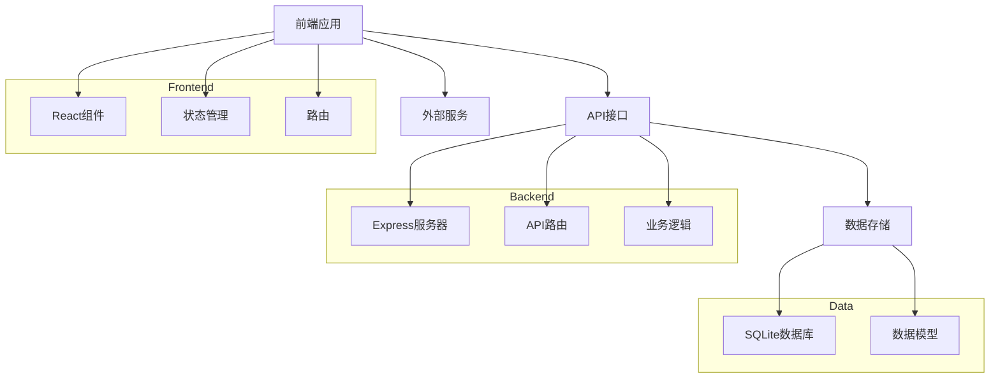
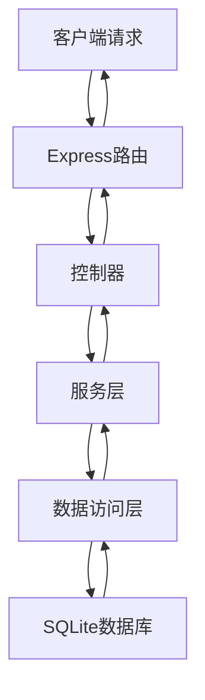
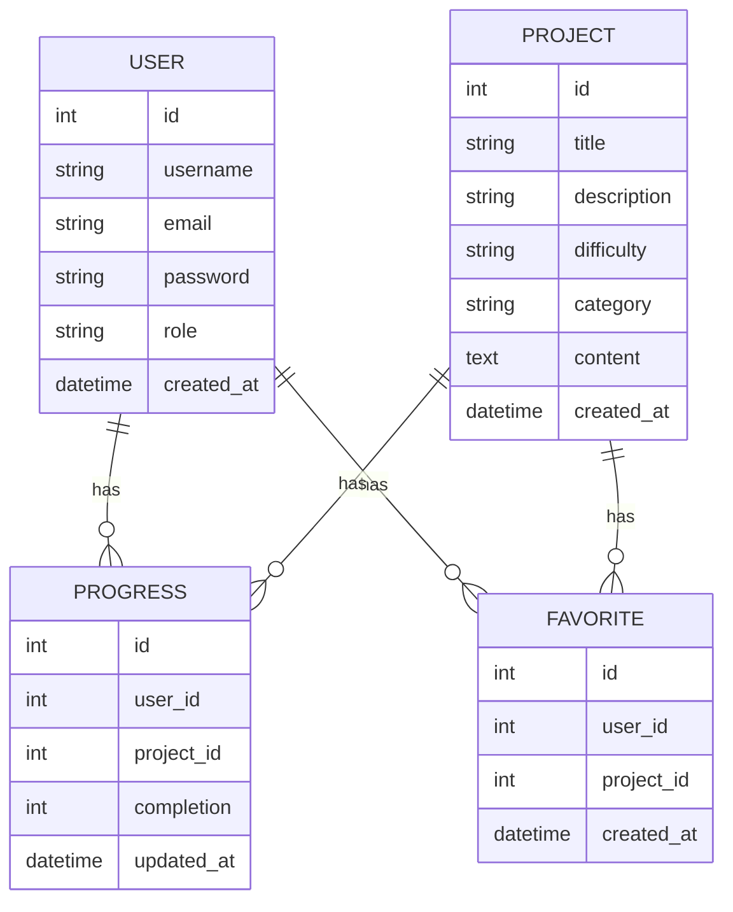

## 1. Architecture Design


## 2. Technology Description
- 前端：React@18 + Tailwind CSS@3 + Vite
- 初始化工具：Vite
- 后端：Express@4
- 数据库：SQLite
- 状态管理：Zustand
- 路由：React Router
- UI组件：自定义组件 + Lucide图标

## 3. Route Definitions
| 路由 | 用途 |
|-------|---------|
| / | 首页 |
| /projects | 项目列表页 |
| /projects/:id | 项目详情页 |
| /profile | 用户个人中心 |
| /login | 登录页 |
| /register | 注册页 |

## 4. API Definitions
### 4.1 项目相关API
- GET /api/projects - 获取项目列表
- GET /api/projects/:id - 获取项目详情
- POST /api/projects - 创建新项目（管理员）
- PUT /api/projects/:id - 更新项目（管理员）
- DELETE /api/projects/:id - 删除项目（管理员）

### 4.2 用户相关API
- POST /api/auth/register - 用户注册
- POST /api/auth/login - 用户登录
- GET /api/auth/me - 获取当前用户信息
- PUT /api/users/:id - 更新用户信息

### 4.3 学习进度API
- GET /api/progress - 获取用户学习进度
- POST /api/progress - 更新学习进度
- GET /api/favorites - 获取用户收藏项目
- POST /api/favorites - 添加收藏
- DELETE /api/favorites/:id - 取消收藏

## 5. Server Architecture Diagram


## 6. Data Model
### 6.1 Data Model Definition


### 6.2 Data Definition Language
```sql
-- 创建用户表
CREATE TABLE IF NOT EXISTS users (
    id INTEGER PRIMARY KEY AUTOINCREMENT,
    username TEXT NOT NULL,
    email TEXT UNIQUE NOT NULL,
    password TEXT NOT NULL,
    role TEXT DEFAULT 'user',
    created_at DATETIME DEFAULT CURRENT_TIMESTAMP
);

-- 创建项目表
CREATE TABLE IF NOT EXISTS projects (
    id INTEGER PRIMARY KEY AUTOINCREMENT,
    title TEXT NOT NULL,
    description TEXT NOT NULL,
    difficulty TEXT NOT NULL,
    category TEXT NOT NULL,
    content TEXT NOT NULL,
    created_at DATETIME DEFAULT CURRENT_TIMESTAMP
);

-- 创建学习进度表
CREATE TABLE IF NOT EXISTS progress (
    id INTEGER PRIMARY KEY AUTOINCREMENT,
    user_id INTEGER NOT NULL,
    project_id INTEGER NOT NULL,
    completion INTEGER DEFAULT 0,
    updated_at DATETIME DEFAULT CURRENT_TIMESTAMP,
    FOREIGN KEY (user_id) REFERENCES users(id),
    FOREIGN KEY (project_id) REFERENCES projects(id),
    UNIQUE(user_id, project_id)
);

-- 创建收藏表
CREATE TABLE IF NOT EXISTS favorites (
    id INTEGER PRIMARY KEY AUTOINCREMENT,
    user_id INTEGER NOT NULL,
    project_id INTEGER NOT NULL,
    created_at DATETIME DEFAULT CURRENT_TIMESTAMP,
    FOREIGN KEY (user_id) REFERENCES users(id),
    FOREIGN KEY (project_id) REFERENCES projects(id),
    UNIQUE(user_id, project_id)
);

-- 插入示例数据
INSERT INTO projects (title, description, difficulty, category, content) VALUES
('电商销售数据清洗与质量诊断', '对电商销售数据进行清洗和质量诊断', '入门', '数据清洗', '项目内容...'),
('用户行为日志分析与漏斗转化', '分析用户行为并构建转化漏斗', '中级', '用户分析', '项目内容...'),
('商品销售趋势分析与库存预警', '分析销售趋势并建立库存预警机制', '中级', '销售分析', '项目内容...');
```