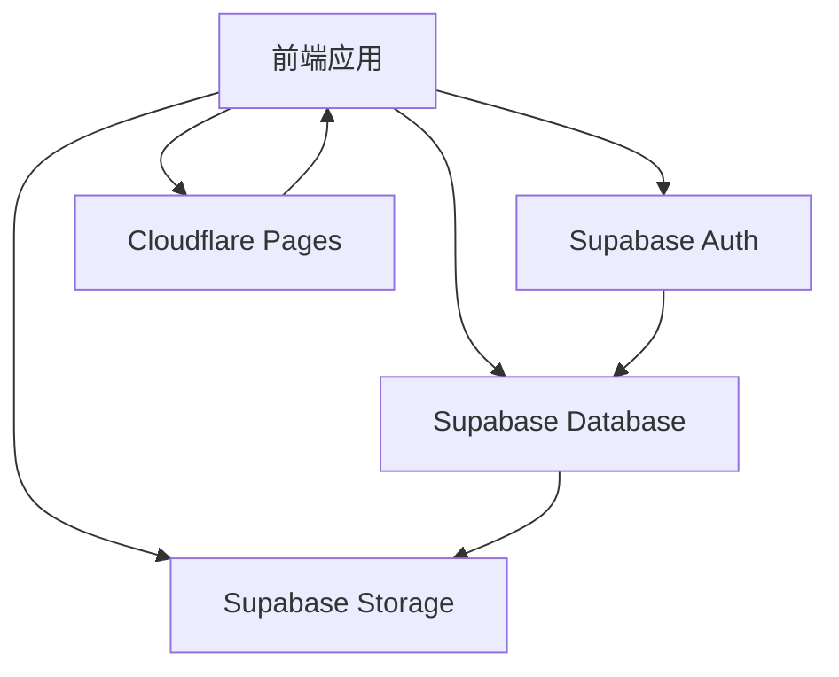
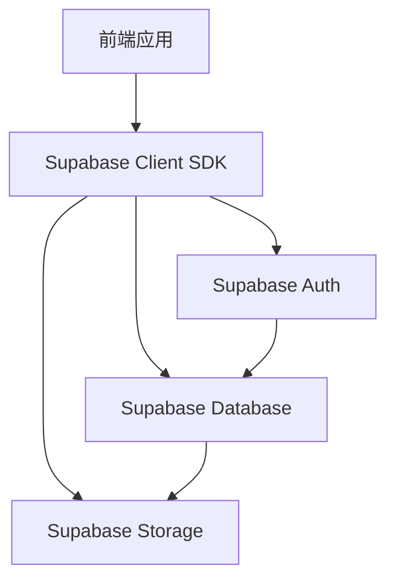
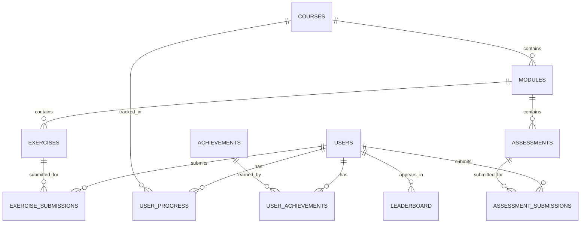

## 1. Architecture Design

```mermaid
flowchart TD
    A[前端应用] --> B[Supabase Auth]
    A --> C[Supabase Database]
    A --> D[Supabase Storage]
    A --> E[Cloudflare Pages]
    B --> C
    C --> D
    E --> A
```

## 2. Technology Description
- 前端：React@18 + TypeScript + Tailwind CSS@3 + Vite
- 初始化工具：vite-init
- 后端：Supabase (提供认证、数据库和存储服务)
- 数据库：Supabase (PostgreSQL)
- 部署：Cloudflare Pages

## 3. Route Definitions
| 路由 | 用途 |
|------|------|
| / | 首页 |
| /courses | 课程中心 |
| /courses/:id | 课程详情 |
| /learning/:courseId/:moduleId | 学习模块 |
| /achievements | 成就中心 |
| /profile | 个人中心 |
| /auth/login | 登录页面 |
| /auth/register | 注册页面 |

## 4. API Definitions
由于使用Supabase作为后端，主要通过Supabase Client SDK进行数据操作，以下是主要的数据操作API：

### 认证API
- `supabase.auth.signUp()`: 用户注册
- `supabase.auth.signInWithPassword()`: 用户登录
- `supabase.auth.signOut()`: 用户登出
- `supabase.auth.getUser()`: 获取当前用户信息

### 课程API
- `supabase.from('courses').select()`: 获取课程列表
- `supabase.from('courses').select('*').eq('id', courseId)`: 获取课程详情
- `supabase.from('user_progress').upsert()`: 更新学习进度

### 学习模块API
- `supabase.from('modules').select().eq('course_id', courseId)`: 获取课程模块
- `supabase.from('exercises').select().eq('module_id', moduleId)`: 获取练习
- `supabase.from('assessments').select().eq('module_id', moduleId)`: 获取测评
- `supabase.from('exercise_submissions').insert()`: 提交练习答案
- `supabase.from('assessment_submissions').insert()`: 提交测评答案

### 成就API
- `supabase.from('achievements').select()`: 获取所有成就
- `supabase.from('user_achievements').select().eq('user_id', userId)`: 获取用户成就
- `supabase.from('user_achievements').insert()`: 授予用户成就
- `supabase.from('leaderboard').select().order('points', { ascending: false })`: 获取排行榜

## 5. Server Architecture Diagram

```mermaid
flowchart TD
    A[前端应用] --> B[Supabase Client SDK]
    B --> C[Supabase Auth]
    B --> D[Supabase Database]
    B --> E[Supabase Storage]
    C --> D
    D --> E
```

## 6. Data Model
### 6.1 Data Model Definition

```mermaid
erDiagram
    USERS ||--o{ USER_PROGRESS : has
    USERS ||--o{ USER_ACHIEVEMENTS : has
    USERS ||--o{ EXERCISE_SUBMISSIONS : submits
    USERS ||--o{ ASSESSMENT_SUBMISSIONS : submits
    USERS ||--o{ LEADERBOARD : appears_in
    COURSES ||--o{ MODULES : contains
    COURSES ||--o{ USER_PROGRESS : tracked_in
    MODULES ||--o{ EXERCISES : contains
    MODULES ||--o{ ASSESSMENTS : contains
    ACHIEVEMENTS ||--o{ USER_ACHIEVEMENTS : earned_by
    EXERCISES ||--o{ EXERCISE_SUBMISSIONS : submitted_for
    ASSESSMENTS ||--o{ ASSESSMENT_SUBMISSIONS : submitted_for
```

### 6.2 Data Definition Language
```sql
-- 用户表 (由Supabase Auth自动创建)
-- 注意：Supabase Auth会自动创建auth.users表

-- 课程表
CREATE TABLE courses (
    id UUID PRIMARY KEY DEFAULT gen_random_uuid(),
    title VARCHAR(255) NOT NULL,
    description TEXT NOT NULL,
    level VARCHAR(50) NOT NULL, -- 初级、中级、高级
    category VARCHAR(100) NOT NULL,
    cover_image_url TEXT,
    created_at TIMESTAMP DEFAULT NOW(),
    updated_at TIMESTAMP DEFAULT NOW()
);

-- 模块表
CREATE TABLE modules (
    id UUID PRIMARY KEY DEFAULT gen_random_uuid(),
    course_id UUID NOT NULL,
    title VARCHAR(255) NOT NULL,
    description TEXT NOT NULL,
    order_index INTEGER NOT NULL,
    created_at TIMESTAMP DEFAULT NOW(),
    updated_at TIMESTAMP DEFAULT NOW()
);

-- 学习内容表
CREATE TABLE learning_contents (
    id UUID PRIMARY KEY DEFAULT gen_random_uuid(),
    module_id UUID NOT NULL,
    type VARCHAR(50) NOT NULL, -- 视频、文档、代码示例等
    title VARCHAR(255) NOT NULL,
    content TEXT NOT NULL,
    order_index INTEGER NOT NULL,
    created_at TIMESTAMP DEFAULT NOW(),
    updated_at TIMESTAMP DEFAULT NOW()
);

-- 练习表
CREATE TABLE exercises (
    id UUID PRIMARY KEY DEFAULT gen_random_uuid(),
    module_id UUID NOT NULL,
    title VARCHAR(255) NOT NULL,
    description TEXT NOT NULL,
    difficulty VARCHAR(50) NOT NULL,
    max_score INTEGER NOT NULL,
    created_at TIMESTAMP DEFAULT NOW(),
    updated_at TIMESTAMP DEFAULT NOW()
);

-- 测评表
CREATE TABLE assessments (
    id UUID PRIMARY KEY DEFAULT gen_random_uuid(),
    module_id UUID NOT NULL,
    title VARCHAR(255) NOT NULL,
    description TEXT NOT NULL,
    duration_minutes INTEGER NOT NULL,
    passing_score INTEGER NOT NULL,
    created_at TIMESTAMP DEFAULT NOW(),
    updated_at TIMESTAMP DEFAULT NOW()
);

-- 测评问题表
CREATE TABLE assessment_questions (
    id UUID PRIMARY KEY DEFAULT gen_random_uuid(),
    assessment_id UUID NOT NULL,
    question_text TEXT NOT NULL,
    question_type VARCHAR(50) NOT NULL, -- 选择题、填空题、简答题等
    options JSONB, -- 选择题选项
    correct_answer TEXT NOT NULL,
    points INTEGER NOT NULL,
    order_index INTEGER NOT NULL,
    created_at TIMESTAMP DEFAULT NOW(),
    updated_at TIMESTAMP DEFAULT NOW()
);

-- 用户进度表
CREATE TABLE user_progress (
    id UUID PRIMARY KEY DEFAULT gen_random_uuid(),
    user_id UUID NOT NULL,
    course_id UUID NOT NULL,
    module_id UUID NOT NULL,
    progress_percentage INTEGER DEFAULT 0,
    completed BOOLEAN DEFAULT FALSE,
    last_accessed_at TIMESTAMP DEFAULT NOW(),
    created_at TIMESTAMP DEFAULT NOW(),
    updated_at TIMESTAMP DEFAULT NOW()
);

-- 练习提交表
CREATE TABLE exercise_submissions (
    id UUID PRIMARY KEY DEFAULT gen_random_uuid(),
    user_id UUID NOT NULL,
    exercise_id UUID NOT NULL,
    answer TEXT NOT NULL,
    score INTEGER DEFAULT 0,
    feedback TEXT,
    submitted_at TIMESTAMP DEFAULT NOW()
);

-- 测评提交表
CREATE TABLE assessment_submissions (
    id UUID PRIMARY KEY DEFAULT gen_random_uuid(),
    user_id UUID NOT NULL,
    assessment_id UUID NOT NULL,
    answers JSONB NOT NULL,
    total_score INTEGER DEFAULT 0,
    passed BOOLEAN DEFAULT FALSE,
    submitted_at TIMESTAMP DEFAULT NOW()
);

-- 成就表
CREATE TABLE achievements (
    id UUID PRIMARY KEY DEFAULT gen_random_uuid(),
    name VARCHAR(255) NOT NULL,
    description TEXT NOT NULL,
    icon_url TEXT,
    points INTEGER NOT NULL,
    requirement JSONB NOT NULL, -- 解锁条件
    created_at TIMESTAMP DEFAULT NOW(),
    updated_at TIMESTAMP DEFAULT NOW()
);

-- 用户成就表
CREATE TABLE user_achievements (
    id UUID PRIMARY KEY DEFAULT gen_random_uuid(),
    user_id UUID NOT NULL,
    achievement_id UUID NOT NULL,
    unlocked_at TIMESTAMP DEFAULT NOW(),
    created_at TIMESTAMP DEFAULT NOW()
);

-- 排行榜表
CREATE TABLE leaderboard (
    id UUID PRIMARY KEY DEFAULT gen_random_uuid(),
    user_id UUID NOT NULL,
    points INTEGER DEFAULT 0,
    rank INTEGER DEFAULT 0,
    updated_at TIMESTAMP DEFAULT NOW()
);

-- 创建索引
CREATE INDEX idx_courses_category ON courses(category);
CREATE INDEX idx_modules_course_id ON modules(course_id);
CREATE INDEX idx_learning_contents_module_id ON learning_contents(module_id);
CREATE INDEX idx_exercises_module_id ON exercises(module_id);
CREATE INDEX idx_assessments_module_id ON assessments(module_id);
CREATE INDEX idx_assessment_questions_assessment_id ON assessment_questions(assessment_id);
CREATE INDEX idx_user_progress_user_id ON user_progress(user_id);
CREATE INDEX idx_user_progress_course_id ON user_progress(course_id);
CREATE INDEX idx_exercise_submissions_user_id ON exercise_submissions(user_id);
CREATE INDEX idx_exercise_submissions_exercise_id ON exercise_submissions(exercise_id);
CREATE INDEX idx_assessment_submissions_user_id ON assessment_submissions(user_id);
CREATE INDEX idx_assessment_submissions_assessment_id ON assessment_submissions(assessment_id);
CREATE INDEX idx_user_achievements_user_id ON user_achievements(user_id);
CREATE INDEX idx_user_achievements_achievement_id ON user_achievements(achievement_id);
CREATE INDEX idx_leaderboard_points ON leaderboard(points DESC);

-- 插入初始数据
-- 课程数据
INSERT INTO courses (title, description, level, category, cover_image_url)
VALUES
('Python基础入门', 'Python编程语言的基础知识，包括语法、数据类型、控制结构等', '初级', '编程语言', 'https://trae-api-cn.mchost.guru/api/ide/v1/text_to_image?prompt=Python%20programming%20basics%20course%20cover&image_size=square_hd'),
('数据分析基础', '数据分析的基本概念和方法，包括数据清洗、数据可视化等', '初级', '数据分析', 'https://trae-api-cn.mchost.guru/api/ide/v1/text_to_image?prompt=Data%20analysis%20basics%20course%20cover&image_size=square_hd'),
('Pandas数据分析', '使用Pandas库进行数据处理和分析', '中级', '数据分析', 'https://trae-api-cn.mchost.guru/api/ide/v1/text_to_image?prompt=Pandas%20data%20analysis%20course%20cover&image_size=square_hd'),
('Matplotlib数据可视化', '使用Matplotlib库创建数据可视化图表', '中级', '数据可视化', 'https://trae-api-cn.mchost.guru/api/ide/v1/text_to_image?prompt=Matplotlib%20data%20visualization%20course%20cover&image_size=square_hd'),
('商务数据分析案例', '实际商务场景中的数据分析案例和解决方案', '高级', '商务分析', 'https://trae-api-cn.mchost.guru/api/ide/v1/text_to_image?prompt=Business%20data%20analysis%20case%20study%20course%20cover&image_size=square_hd');

-- 成就数据
INSERT INTO achievements (name, description, icon_url, points, requirement)
VALUES
('Python初学者', '完成Python基础入门课程', 'https://trae-api-cn.mchost.guru/api/ide/v1/text_to_image?prompt=Python%20beginner%20badge&image_size=square', 100, '{"course_id": "Python基础入门", "completed": true}'),
('数据分析新手', '完成数据分析基础课程', 'https://trae-api-cn.mchost.guru/api/ide/v1/text_to_image?prompt=Data%20analysis%20novice%20badge&image_size=square', 150, '{"course_id": "数据分析基础", "completed": true}'),
('Pandas大师', '完成Pandas数据分析课程', 'https://trae-api-cn.mchost.guru/api/ide/v1/text_to_image?prompt=Pandas%20master%20badge&image_size=square', 200, '{"course_id": "Pandas数据分析", "completed": true}'),
('可视化专家', '完成Matplotlib数据可视化课程', 'https://trae-api-cn.mchost.guru/api/ide/v1/text_to_image?prompt=Data%20visualization%20expert%20badge&image_size=square', 200, '{"course_id": "Matplotlib数据可视化", "completed": true}'),
('商务分析专家', '完成商务数据分析案例课程', 'https://trae-api-cn.mchost.guru/api/ide/v1/text_to_image?prompt=Business%20analysis%20expert%20badge&image_size=square', 250, '{"course_id": "商务数据分析案例", "completed": true}'),
('练习达人', '完成10个练习', 'https://trae-api-cn.mchost.guru/api/ide/v1/text_to_image?prompt=Exercise%20master%20badge&image_size=square', 50, '{"exercises_completed": 10}'),
('测评高手', '通过5个测评', 'https://trae-api-cn.mchost.guru/api/ide/v1/text_to_image?prompt=Assessment%20master%20badge&image_size=square', 75, '{"assessments_passed": 5}'),
('学习先锋', '连续学习7天', 'https://trae-api-cn.mchost.guru/api/ide/v1/text_to_image?prompt=Learning%20pioneer%20badge&image_size=square', 100, '{"consecutive_days": 7}');

-- 权限设置
-- 允许匿名用户读取课程和成就信息
GRANT SELECT ON courses, modules, learning_contents, exercises, assessments, assessment_questions, achievements TO anon;

-- 允许认证用户进行所有操作
GRANT ALL PRIVILEGES ON user_progress, exercise_submissions, assessment_submissions, user_achievements, leaderboard TO authenticated;
GRANT ALL PRIVILEGES ON courses, modules, learning_contents, exercises, assessments, assessment_questions, achievements TO authenticated;